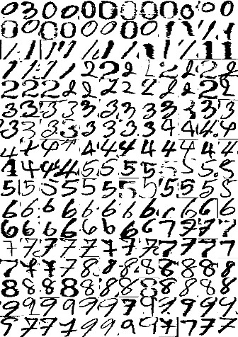

# Thai-MNIST
Thai digit handwriting and example code
   Thai-MNIST is a dataset of thai handwrite digit images—consisting of a training set of 280,000 examples and a test set of 31,000 examples (75,000 examples and a test set of 8,400 examples in Alphabet Class) Each example is a 28x28 grayscale image, associated with a label from 10 classes. We intend Thai-MNIST to serve as a direct drop-in replacement for the original MNIST dataset for benchmarking machine learning algorithms. It shares the same image size and structure of training and testing splits.

# Download Dataset
- Number dataset for train and validate [download](https://drive.google.com/open?id=1cZmfAfYXegdGGNISboq7pvPR-KnXmduw)
- Alphabet dataset for train and validate [download](https://drive.google.com/open?id=1VMIEdmp_uPqywq3Kcd4HLwhfpbbFCHX5)

# Requirement
- Python  >= 3.4
  - TensorFlow >= 1.0
  - keras
  - numpy
  - cv2
  - PIL
